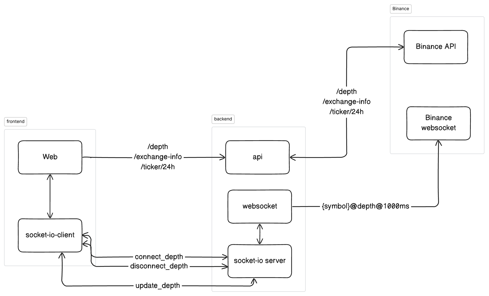
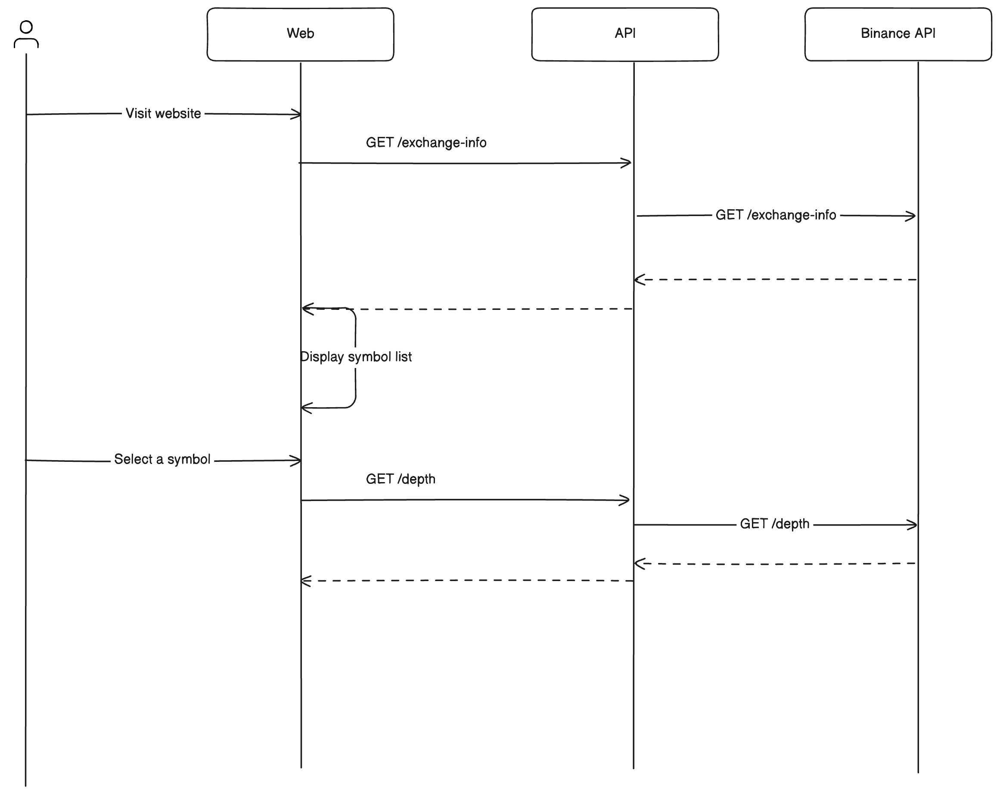
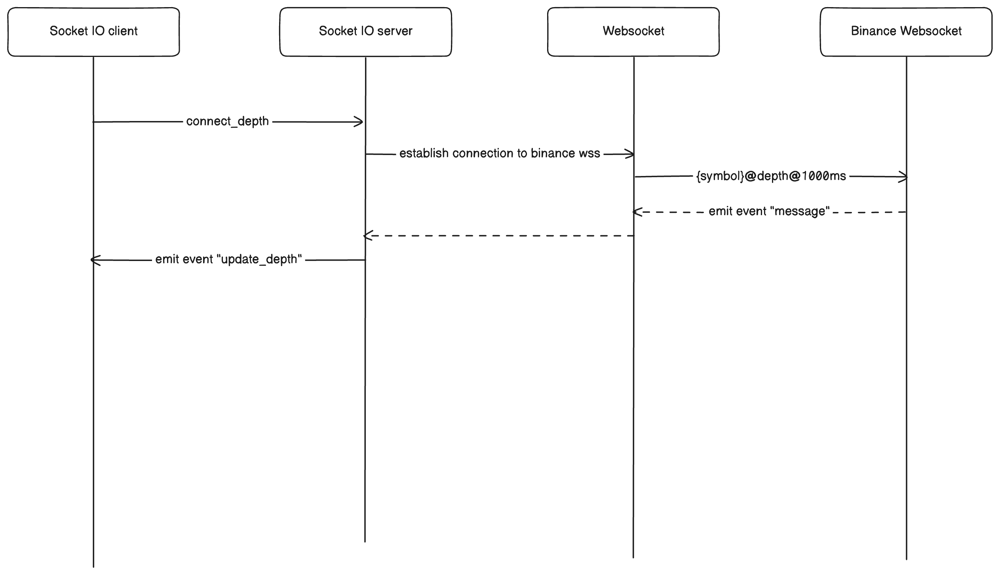

# Description
An order book of crypto marketplace using Binance public API

# Tech stack
A monorepo using Lerna to manage frontend and backend
Frontend:
  - React
  - Socket IO client
  - Shadcn/ui
  - React Query
  - TailwindCSS

Backend:
  - Fastify
  - Websocket
  - Socket IO server

# Design

# High-level system design

# Sequence diagram

When user visit website, we have this flow

1. At first, when user visits the page, it will fetch the exchange info to get list of symbol
2. When user select a symbol, it then call /depth API to get a snapshot of the order book

After user select a symbol, we have this flow

1. Firstly, socket client emits event "connect_depth", which notify socket server to open a connect stream
2. A websocket connection will be established to Binance stream
3. When websocket connection receive a message, it then use socket server to emit event "update_depth" to client
4. Client update order book according to the received data

The flow above is following the suggestion from Binance [How to manage a local order book correctly](https://binance-docs.github.io/apidocs/spot/en/#diff-depth-stream)

# How to run
`sh start.sh`

